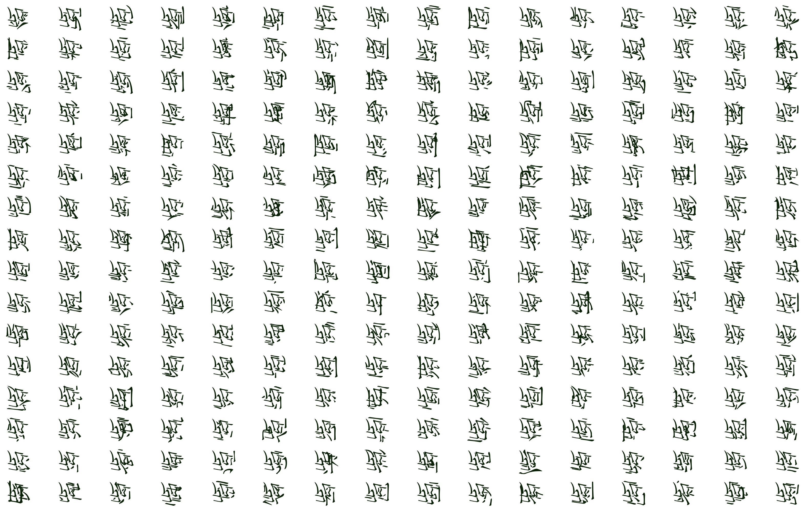
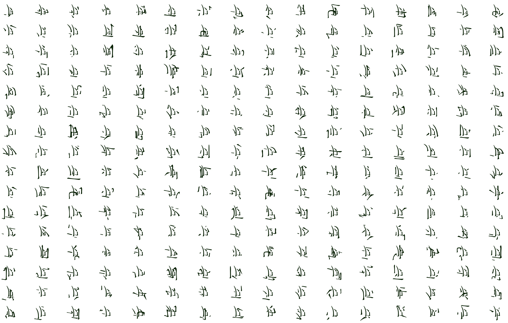
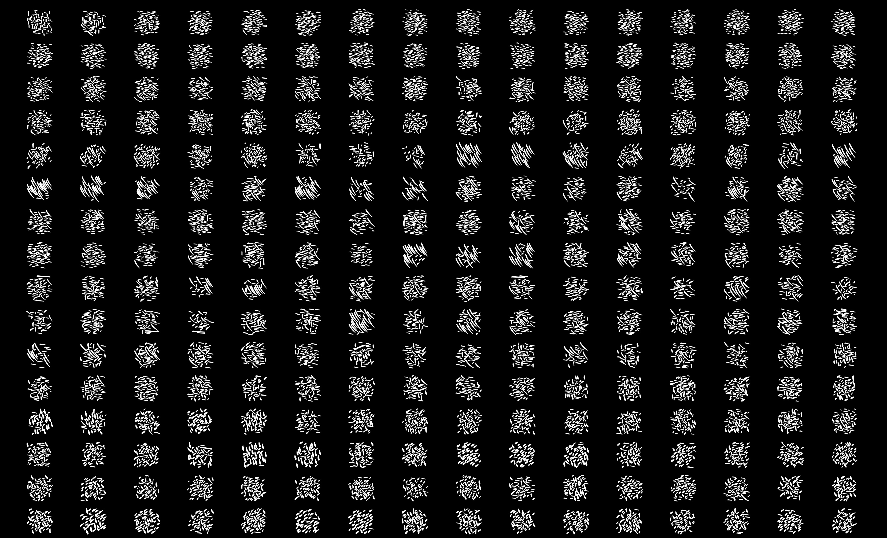

```{bash}
./dyn.js database data/all.json data/graphicsJa.txt
./dyn.js predict dictionary.txt
php -S localhost:3000 &
open http://localhost:3000/page.html
```


```{bash}
./dyn.js database data/all.json data/graphicsJa.txt
./dyn.js variation dictionary.txt
php -S localhost:3000 &
open http://localhost:3000/page.html
```










